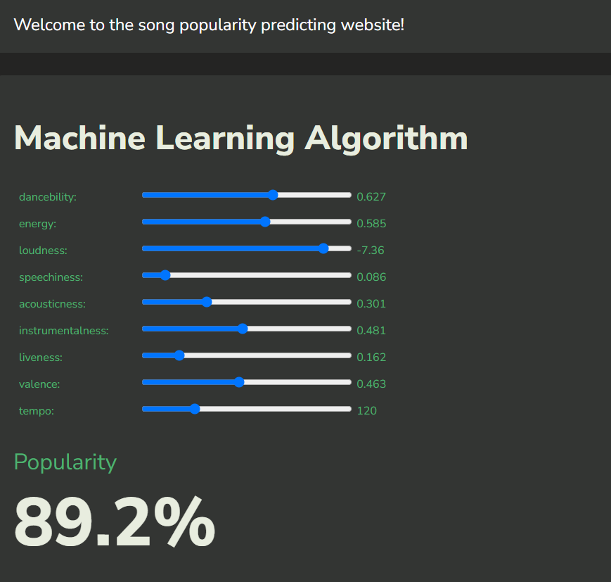

# Popularity Prediction
Predicting popularity of a song with spotify's API

## Running Neural Network

python3 popularity_2.py

## Running K-Nearest_Neighbors

python3 main.py

## Accompanied Website (Neural Network Model)

https://kairos310.github.io/popularityprediction/

## Add playlists to train
1. run query.py
2. use open.spotify.com
3. copy last part of url
4. paste where prompted
